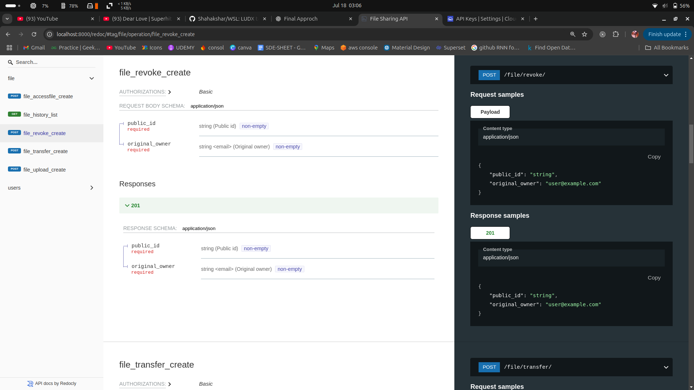
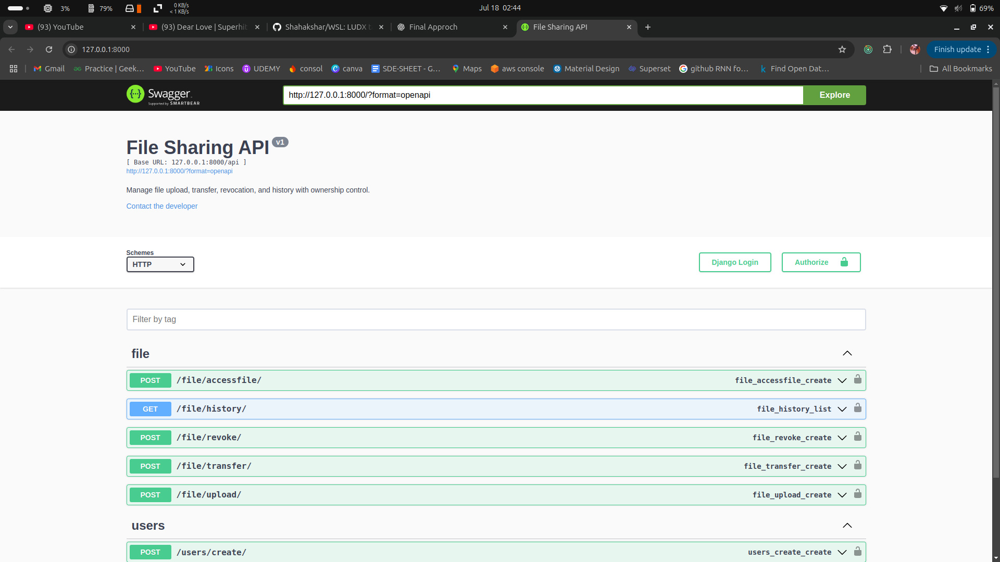
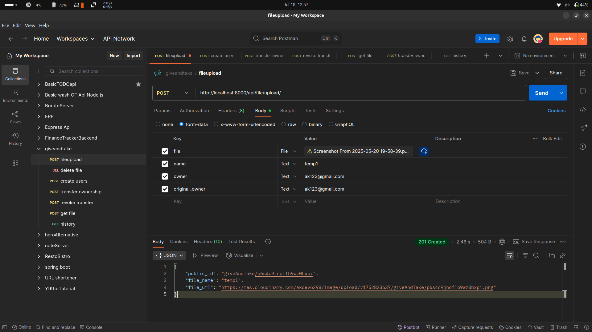
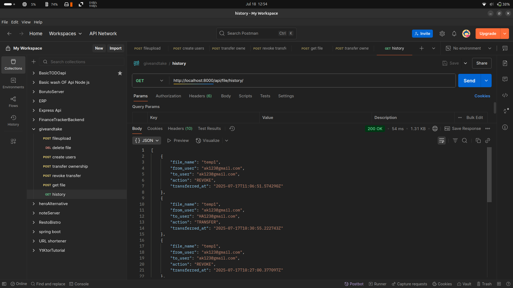
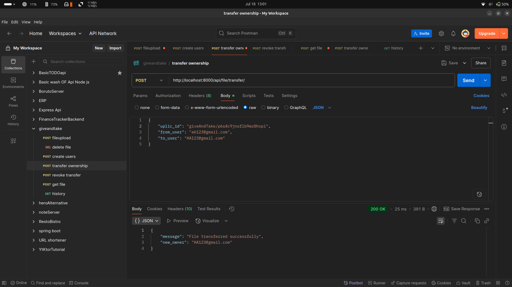
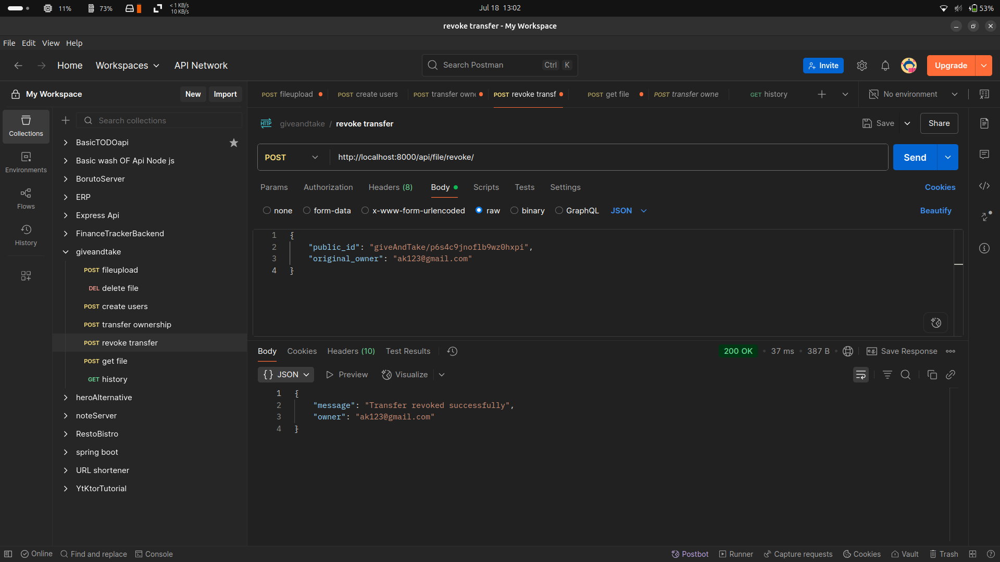
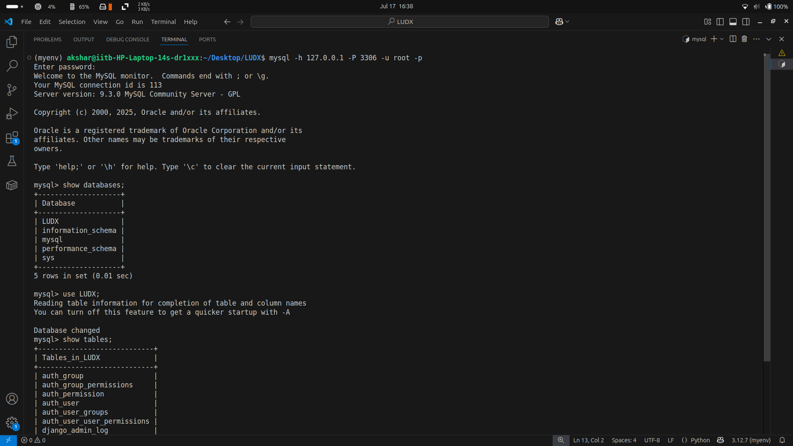
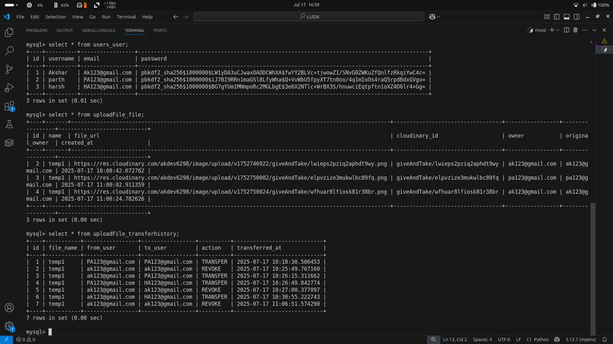

# 🛠️ Developed Ownership Transfer and Revoke Feature

A robust solution for managing **document ownership transfers** and **revocations**, ensuring secure and traceable control over digital assets. This project addresses key challenges in ownership management, providing clear transfer logic, a robust revoke mechanism, and comprehensive logging.

---

## 📌 Snippet Of My Work

Take a quick look at the core functionalities and their interfaces:

  
  

<i>Left: Auto-generated API documentation using Swagger UI. | Right: Interactive API endpoint testing via Swagger.</i>

---

  
  

<i>Left: User interface for uploading documents/files. | Right: Comprehensive logs of all ownership transfers and revocations.</i>

---

  
  

<i>Left: Seamless ownership transfer from one user to another. | Right: Original owner revoking all transferred ownership.</i>

---

  
  

<i>Left: Database schema showing `users`, `uploadFile_file`, and `uploadFile_transferHistory` tables. | Right: Sample data within the key database tables.</i>

---

## 💡 Problem Statement

This project addresses the following core challenges in document ownership management:

### 1. Ownership Transfer
Implement a system where the **current owner** of a document (not necessarily the creator) can transfer ownership to another user.
*Example: User A creates a document and transfers ownership to User B. User B then becomes the current owner and can further transfer it.*

### 2. Ownership Revocation
Enable the **original creator** of a document to revoke ownership at any point, regardless of how many transfers have occurred.
*Example: User A (original creator) can revoke ownership even if it has been transferred from B to C, then to D.*

### 3. Comprehensive Logging
Maintain a **separate, dedicated log** for every single transfer and revoke action, ensuring a complete audit trail.

---

## ✅ Intuition and Solution Design

My approach focuses on a lean and effective data model to manage ownership:

### ➤ Transfer Logic:
* When a file is created, the creator is marked as both the `original_owner` and the `current_ownership`.
* Any subsequent transfer updates only the `current_ownership` field. This ensures that only the current owner has the right to initiate new transfers.

### ➤ Revoke Logic:
* The `original_owner` field is crucial here. Only the user specified in this field can initiate a revoke action.
* Upon revocation, the `current_ownership` is reset, effectively taking the document out of circulation for transfers. The system does *not* need to maintain a complex chain of previous owners, simplifying the logic while meeting the requirements.

### ➤ Database Structure:
I designed a straightforward table structure to support these operations:

| Field Name     | Description                                     |
| :------------- | :---------------------------------------------- |
| `file_id`      | Unique identifier for each document             |
| `file_name`    | Name of the uploaded file                       |
| `created_at`   | Timestamp of file creation                      |
| `original_owner` | ID of the user who originally created the file |
| `ownership`    | ID of the user who currently holds ownership    |
| `...`          | Other relevant fields                           |

This design efficiently tracks both the original creator (for revocation) and the current owner (for transfer), fulfilling all problem requirements.

---

## 🚀 How to Explore and Test

To interact with the API documentation and test the endpoints locally, simply navigate to:

* **[http://localhost:8000/](http://localhost:8000/)**
* **[http://localhost:8000/redoc/](http://localhost:8000/redoc/)** (for an alternative documentation view)

These links will provide you with the auto-generated Swagger UI, allowing you to explore the API and test the ownership transfer and revoke functionalities in real-time.

<!-- # 🛠️ Developed Ownership Transfer and Revoke Feature

## 📌 Snippet Of My Work

  
  

<i>Left: Swagger UI auto-generated API documentation. | Right: Sample testing of endpoints using Swagger.</i>

  
  

<i>Left: Upload Document or file or contract paper by User. | Right: History of the transaction that are made by users (logs).</i>

  
  

<i>Left: Ownership transfer from one user to another. | Right: Revoke action performed by original owner.</i>

  
  

<i>Left: LUDX Database created and having users, uploadFile_file, uploadFile_transferHistory tables are created in side it. | Right: Content of the Tables. </i>

## 📌 PROBLEM 1

In the document, a problem is described in which you have to implement **ownership transfer and revoke functionality**.

For example:  
If user **A** has created or uploaded a document, then that person is the **owner** of that file and also holds **ownership** of the document.  

Now, user A has the right to give ownership to another user — let’s say **B**. After this, **B** becomes the current owner of the file and has the right to **transfer ownership** further.  
This is the exact scenario explained in the problem:  
> A person who currently holds ownership of the document has the right to transfer it, not necessarily the one who originally created it.

---

## 📌 PROBLEM 2

Only the **original creator** of the document has the right to **revoke** ownership.  

They can simply revoke the ownership transfer.  
So even if ownership has been transferred to multiple users, the original creator retains the authority to revoke all transfers.

---

## 📌 PROBLEM 3

Log **every transfer and revoke** action in a **separate database**.

---

## 💡 Intuition and Approach

### ➤ Transfer Logic:
- A creates a file  
  → A is the creator and the current owner.  
- A ➝ B  
  → A gives ownership to B  
  → B becomes the current owner.  
- B ➝ C  
  → B gives ownership to C  
  → C becomes the current owner.

### ➤ Revoke Logic:
- If A revokes the permission, I simply remove the ownership from **all users**.
- But here’s the catch:  
  The question does **not** require maintaining the full chain of ownership transfers.

---

## ✅ Solution Design

I have maintained the entries of:
- `original_owner`
- `ownership`

There are also some other important fields relevant to the revoke case.

The table looks like this:

| file_id | file_name | created_at | original_owner | ownership | ... |

This is the structure I’m thinking of for the given task, which aligns with the provided requirements.

---

# For Testing Endpoints and For Documentation 

## http://localhost:8000/ or http://localhost:8000/redoc/ -->

